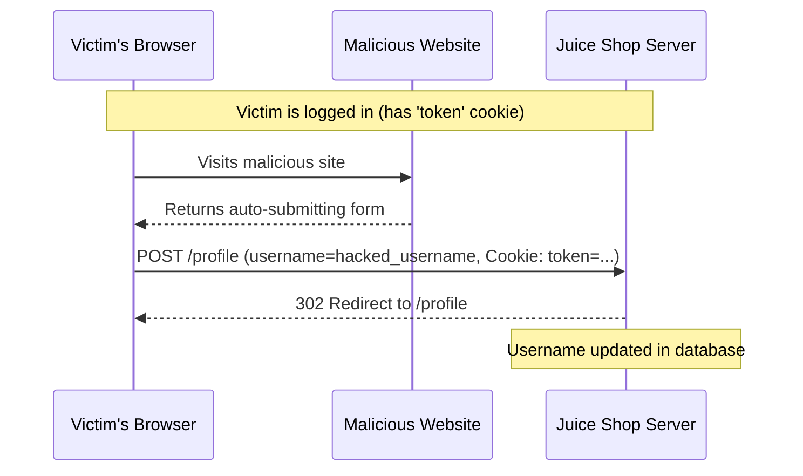

# Cross-Site Request Forgery (CSRF) in Update User Profile

## EXECUTIVE SUMMARY
The OWASP Juice Shop application is vulnerable to Cross-Site Request Forgery (CSRF) on its user profile update endpoint (`/profile`). An attacker can craft a malicious website that, when visited by an authenticated user, automatically submits a request to change the user's username without their knowledge or consent. This is possible because the server relies solely on a session token stored in a cookie for authentication and does not implement any CSRF protection mechanisms (like anti-CSRF tokens or SameSite cookie attributes) for this state-changing operation.

## Root Cause Analysis (RCA)
The vulnerability exists in `routes/updateUserProfile.ts`. The `updateUserProfile` function retrieves the user's session from `req.cookies.token` but does not perform any checks to ensure that the request originated from a trusted source.

```typescript
// routes/updateUserProfile.ts:15-22
export function updateUserProfile () {
  return async (req: Request, res: Response, next: NextFunction) => {
    const loggedInUser = security.authenticatedUsers.get(req.cookies.token)

    if (!loggedInUser) {
      next(new Error('Blocked illegal activity by ' + req.socket.remoteAddress))
      return
    }
```

The code even contains a "challenge" that acknowledges the CSRF vulnerability:

```typescript
// routes/updateUserProfile.ts:31-37
      challengeUtils.solveIf(challenges.csrfChallenge, () => {
        const url = config.get<string>('challenges.overwriteUrlForCsrfChallenge')
        return ((req.headers.origin?.includes('://' + url.replace(/^https?:\\/\\//, ''))) ??
          (req.headers.referer?.includes('://' + url.replace(/^https?:\\/\\//, '')))) &&
          req.body.username !== user.username
      })
```

The server then proceeds to update the user profile based on the `username` provided in `req.body`:

```typescript
// routes/updateUserProfile.ts:39
      const savedUser = await user.update({ username: req.body.username })
```

Since the application accepts `application/x-www-form-urlencoded` (and `application/json`), a standard HTML form can be used to trigger this update.

### Threat Model Analysis
- **Trust Boundary**: The application trusts that any request containing a valid `token` cookie is a legitimate request from the user.
- **Boundary Bypass**: An attacker can bypass this trust by inducing the user's browser to send a request to the `/profile` endpoint. Because browsers automatically include cookies for the target domain in such requests, the server treats the malicious request as authentic.
- **Impact**: Unauthorized modification of user profile data. In this specific case, the username can be changed.

## Exploitation & Reproduction

### Scenario
1. A victim user is logged into the OWASP Juice Shop.
2. An attacker lures the victim to a malicious website.
3. The malicious website contains a hidden HTML form that targets `http://localhost:3000/profile`.
4. The form is automatically submitted via JavaScript when the victim visits the site.
5. The victim's browser sends the POST request along with the `token` cookie.
6. The Juice Shop server processes the request and updates the victim's username.

### Reproducing the Vulnerability



#### Steps to reproduce using the provided exploit:
1. Start the Juice Shop application.
2. Run `exploit.sh`.

The `exploit.sh` script automates the following:
1. Registers a new user (`victim@juice-sh.op`).
2. Logs in to obtain a valid `token`.
3. Sends a POST request to `/profile` using the `token` in the `Cookie` header and `application/x-www-form-urlencoded` body, simulating a CSRF attack.
4. Verifies that the user's profile has been updated with the new username.

## FIX RECOMMENDATION
1. **Implement Anti-CSRF Tokens**: Include a unique, cryptographically strong, and unpredictable token in every state-changing request. The server should verify this token before processing the request.
2. **Use SameSite Cookie Attribute**: Set the `SameSite` attribute of the `token` cookie to `Lax` or `Strict`. This prevents the browser from sending the cookie in cross-site POST requests.
3. **Verify Origin/Referer Headers**: While not a primary defense, checking the `Origin` or `Referer` header can provide an additional layer of security.
