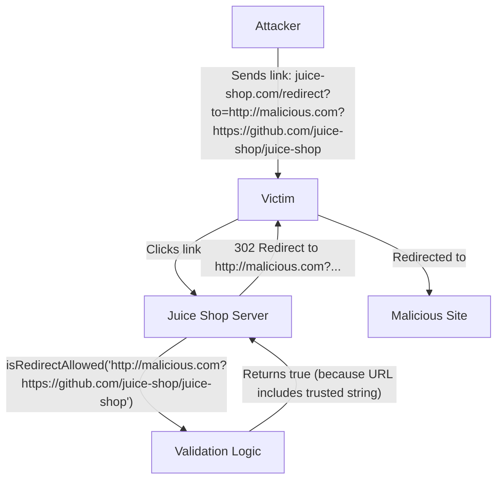

# Open Redirect via Weak URL Validation

## Executive Summary
The OWASP Juice Shop application is vulnerable to an open redirect due to weak validation of the `to` parameter in the `/redirect` endpoint. The validation logic uses `String.prototype.includes()` against an allowlist of URLs, which allows an attacker to bypass the security check by including a trusted URL as a query parameter or fragment in a malicious link. This can be used in phishing attacks to trick users into visiting malicious websites while appearing to stay on a trusted domain.

## Root Cause Analysis
The vulnerability exists in the `isRedirectAllowed` function within `lib/insecurity.ts`. The function iterates through a set of allowed URLs and checks if the provided redirect URL *contains* any of the allowed URLs.

### Vulnerable Code Snippet
In `lib/insecurity.ts`:
```typescript
export const isRedirectAllowed = (url: string) => {
  let allowed = false
  for (const allowedUrl of redirectAllowlist) {
    allowed = allowed || url.includes(allowedUrl) // vuln-code-snippet vuln-line redirectChallenge
  }
  return allowed
}
```

The `redirectAllowlist` contains several trusted URLs:
```typescript
export const redirectAllowlist = new Set([
  'https://github.com/juice-shop/juice-shop',
  'https://blockchain.info/address/1AbKfgvw9psQ41NbLi8kufDQTezwG8DRZm',
  'https://explorer.dash.org/address/Xr556RzuwX6hg5EGpkybbv5RanJoZN17kW',
  'https://etherscan.io/address/0x0f933ab9fcaaa782d0279c300d73750e1311eae6',
  'http://shop.spreadshirt.com/juiceshop',
  'http://shop.spreadshirt.de/juiceshop',
  'https://www.stickeryou.com/products/owasp-juice-shop/794',
  'http://leanpub.com/juice-shop'
])
```

Because it uses `.includes(allowedUrl)`, an attacker can craft a URL like `http://example.com?https://github.com/juice-shop/juice-shop`. This URL is not on the allowlist itself, but it *contains* one of the allowlisted strings, causing `isRedirectAllowed` to return `true`.

## Exploitation & Reproduction

### Threat Model Analysis
- **Trust Boundary**: The application serves as a trusted origin. The `/redirect` endpoint is intended to safely redirect users to known, trusted external sites.
- **Bypass**: The weak validation allows an attacker to redirect users to any arbitrary domain (e.g., `example.com`), bypassing the intended restriction to the allowlist.
- **Impact**: This is a classic Open Redirect. It can be used to facilitate phishing campaigns, as users may trust a link that begins with the legitimate Juice Shop domain.

### Reproducing the Vulnerability
1. Start the Juice Shop application.
2. Send a GET request to the `/redirect` endpoint with a `to` parameter that points to a malicious site but includes a trusted URL from the allowlist.
3. Observe that the server responds with a `302 Found` status code and a `Location` header pointing to the malicious site.



### Exploit
The `exploit.sh` script demonstrates this by sending a request to `http://localhost:3000/redirect?to=http://example.com?https://github.com/juice-shop/juice-shop` and verifying that the `Location` header in the response is indeed the malicious URL.

## Fix Recommendation
The validation should be strengthened to ensure the URL starts with an allowed entry or matches exactly, rather than just containing it. Using a proper URL parsing library and checking the hostname and protocol is recommended.

In `lib/insecurity.ts`, change `url.includes(allowedUrl)` to a stricter check, such as `url.startsWith(allowedUrl)`.

```typescript
export const isRedirectAllowed = (url: string) => {
  for (const allowedUrl of redirectAllowlist) {
    if (url.startsWith(allowedUrl)) {
      return true
    }
  }
  return false
}
```
Note: Even `startsWith` can sometimes be tricky with subdomains (e.g., `https://github.com.malicious.com`). A more robust approach is to parse the URL and compare the origin.
